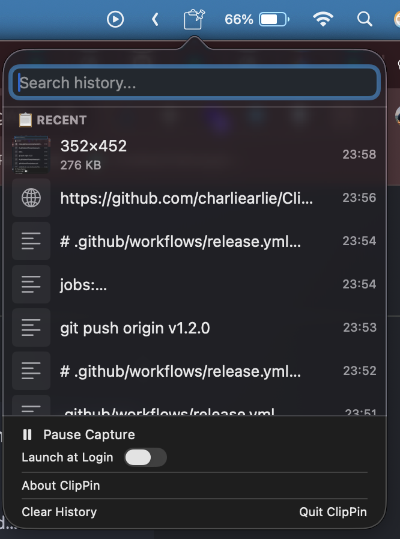

# ClipPin

A lightweight macOS clipboard manager with first-class pinning support.



## Features

- 📋 **Clipboard History** - Automatically saves your last 50 text clips and 20 images
- 📌 **Pin Important Items** - Pin frequently-used snippets to the top
- 🖼️ **Image Support** - Thumbnails in the list, full preview on hover
- 🔍 **Search** - Quickly find any clip
- ⚠️ **Sensitive Data Detection** - Warns about credit cards, API keys
- 🚀 **Launch at Login** - Start automatically with your Mac

## Installation

1. Download `ClipPin-v1.2.0.zip` from [Releases](https://github.com/charliearlie/ClipPin/releases)
2. Unzip and move `ClipPin.app` to Applications
3. Right-click → Open (first time only)

## Privacy

All data stored locally in `~/Library/Application Support/ClipPin/`. Nothing is sent to any server.

## Uninstall

1. Quit ClipPin
2. Delete ClipPin.app from Applications
3. Delete `~/Library/Application Support/ClipPin/`

## Building from Source
```bash
git clone https://github.com/yourusername/clippin.git
cd clippin
./package_app.sh
open ClipPin.app
```

## License

MIT License - see LICENSE